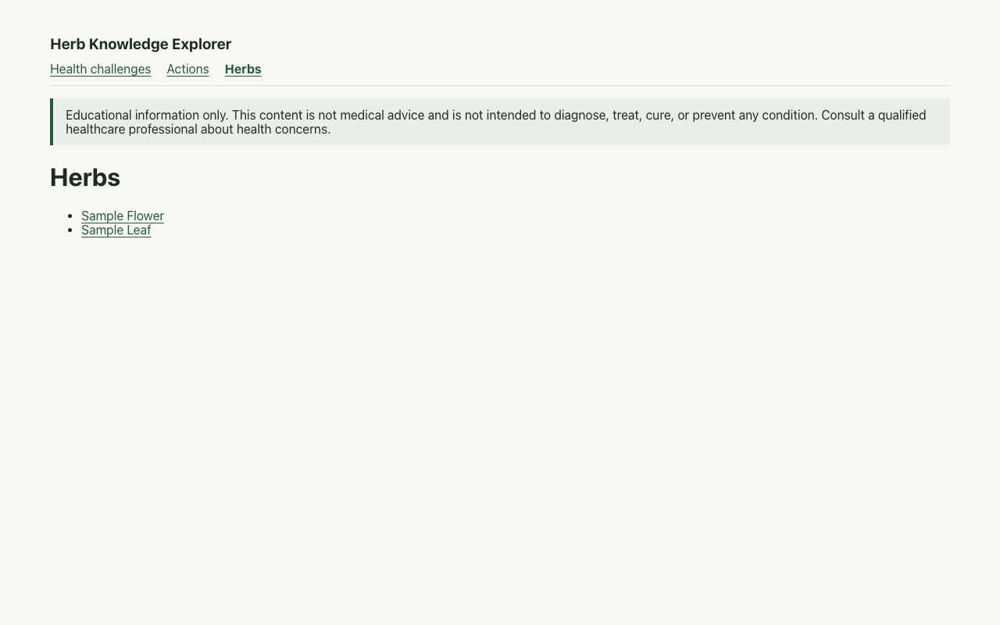

# Herb Knowledge Explorer user guide

This guide describes the browsing features implemented so far. The current development catalog
contains synthetic sample entries for testing; it is not approved health content and is not a
customer release.

## Browse by entry type

Use the navigation at the top of the page to choose **Health challenges**, **Actions**, or
**Herbs**. Each view lists only entries of that type, sorted by name. Select an entry to open its
detail page.

If a type has no entries, the page displays a message instead of an empty or broken list.

## Explore related entries

On an entry detail page, follow the links under Health challenges, Actions, or Herbs to explore
the published relationships. For example, open an action from a challenge, then choose an herb
associated with that action. Use the browser's Back button to return to the previous entry.

## Educational disclaimer

The educational disclaimer appears in the shared layout on browse and detail pages:

> Educational information only. This content is not medical advice and is not intended to
> diagnose, treat, cure, or prevent any condition. Consult a qualified healthcare professional
> about health concerns.

It explains the app's educational purpose; it does not make the synthetic development catalog
approved health content. Do not use the sample entries as medical guidance.

## Prepare an approved content import (separate local app)

Run `npm run curator:dev` and open `http://127.0.0.1:5174/` to use the separate **Content
Curator** app. It lets you select one or more Markdown files from your device. It
processes selected files locally in your browser; it does not upload them or change the source
notes. It has its own local-only entry point and is not part of the deployed reader app. The
preview shows the supported frontmatter and, for herbs, each of the five recognized
Apothecary & Applications subsections. Missing subsection headings and ignored frontmatter
field names are called out, and other note-body sections are not included.

Review the preview carefully and check the approval box only for records you want considered for
publication. Relationship issues must be resolved before the ZIP can be downloaded. Extract the
approved-record ZIP at the repository root, run the content importer, and review the generated
catalog and app before committing or deploying. Preparing the ZIP does not publish anything.
